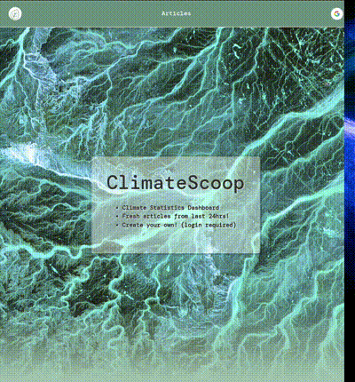

# ClimateScoop

ClimateScoop is an easy-to-use web app designed to provide high-quality information on climate change. Our goal is to help users stay informed about the topic on a daily basis and contribute their own ideas and perspectives.

 

---

## Introduction

Welcome to ClimateScoop, a web app created by Alan, Danica, and Rafael as our final project for the Full Stack Web Development course at DCI Digital Career Institute. Our goal with this project was to provide an easy-to-use platform for users to stay informed about climate change and contribute their own ideas and perspectives.

 

---

## Demo & Presentation

- While our project is not yet live, you can watch a demo on YouTube by clicking [here](https://www.youtube.com/watch?v=wblm7sZ4vXg) to see ClimateScoop in action!
- You can also view our presentation slides on Canva [here](https://www.canva.com/design/DAFefkGRilE/KOvS9F8eLmYrBKVlu45erQ/view?utm_content=DAFefkGRilE&utm_campaign=designshare&utm_medium=link&utm_source=publishsharelink).
- Stay tuned for updates on when our app will be available for public use.

  

 

---

## Features

ClimateScoop has three awesome features:

- **Visualization Charts**: Our home page displays charts that visually represent how climate change is affecting the world.
- **External Articles**: Our app gathers the latest climate change articles from around the web, in one place.
- **Contribute**: We've made it easy for anyone to contribute their own ideas on climate change by logging in with their Google account - no password required!

 

---

## Technologies Used

Our app was built using the following technologies:

- HTML / CSS / JavaScript
- React
- Node.js / Express
- MongoDB
- Google Identity Services
- OAuth 2.0

 

---

## Future Plans

In the future, we plan to implement like and save functionalities, as well as a comments section for each article. We also aim to grow the app to provide a community feature where people can connect or exchange contact information. We plan to deploy the app live in the near future.

 

---

## Contributors

- Alan Diko
- Danica Yener
- Rafael B Oliveira

 

---

## Credits

We'd like to give special thanks to our instructors and mentors at DCI Digital Career Institute GmbH for their guidance and support throughout this one year journey.

 

---

## Contributing

We welcome contributions from other developers! If you'd like to contribute to ClimateScoop, please follow these guidelines:

- Submit bug reports and feature requests through the issue tracker
- Make sure your code adheres to the project's coding style
- Submit pull requests with clear descriptions and explanations of your changes

 

---

## License

This project is licensed under the MIT License - see the [LICENSE.md](./LICENSE.md) file for details.

 

---

 
 
 
We hope you find ClimateScoop useful!
